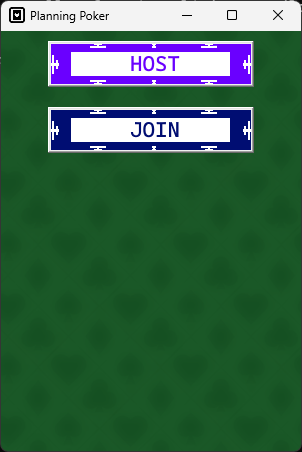
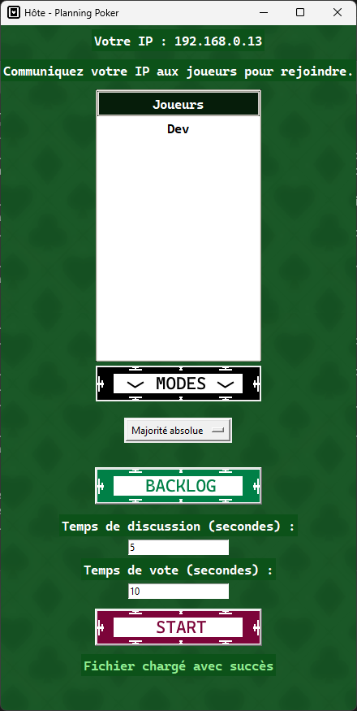
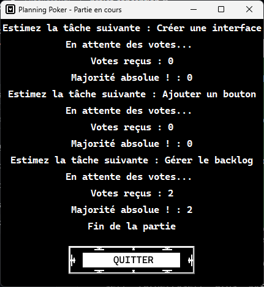
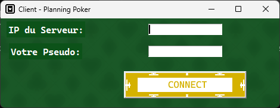
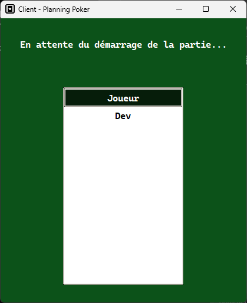
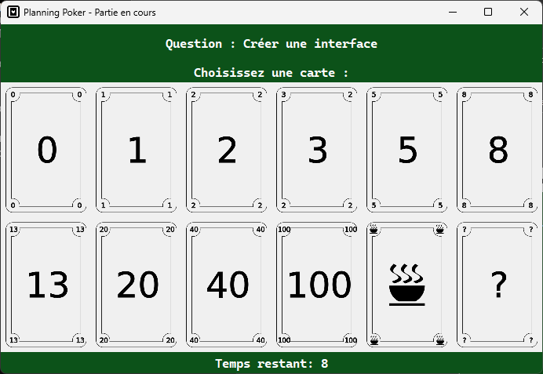

# Nom du Projet

Ce projet à été réalisé dans le cadre du cours de CAPI (Conception Agile de Projet Informatique), dans le but de nous apprendre les principales techniques de gestion de développement de projet informatique.
L'application réalisée est une application connue dans ce milieu, le Planning Poker.

---

## Table des matières

1. [Aperçu du Projet](#aperçu-du-projet)
2. [Fonctionnalités](#fonctionnalités)
3. [Installation](#installation)
4. [Utilisation](#utilisation)

---

## Aperçu du Projet

Ajoute une capture d'écran ou une courte démo du projet ici pour donner une idée claire de ce qu'il fait.

---

## Fonctionnalités

- Charger un backlog 
- Organiser et participer à des parties de Planning Poker
- Générer un backlog avec les difficultés estimées
- Parties en local (sur le même réseau)
- Nombre de joueurs illimités
- Partie hôte : fonctionne comme un server : logs, résultats, avancement de la partie...
  
---

## Installation

Explique comment installer et configurer ton projet localement.

```bash
# Clonez le repo
$ git clone https://github.com/ton-utilisateur/nom-du-projet.git

# Accédez au dossier du projet
$ cd projet-conception

# Installez les dépendances (conseillé de le faire dans un environnement créé au préalable)
$ pip install -r requirements.txt
```

## Utilisation

Il est conseillé pour un test sur la même machine d'avoir un terminal pour simuler l'hôte et un autre pour simuler un joueur

- Lancement de l'application :
```bash
# Exemple d'exécution du projet
$ cd src/
$ python .\interfacev6
```

- Utilisation de l'interface :

Menu principal :

  
Côté hôte :
   
Cliquer le bouton 'HOST'


- Choisir le fichier du backlog
- Définir les paramètres de la partie (temps de discussion, de vote et mode de jeu)
- Quand tous les joueurs sont connectés : cliquez 'START'

Aperçu de la console :


Cette interface permet à l'hôte de consulter : 
- La question actuellement traitée
- L'avancement de la partie
- Les votes reçus
- L'état de la validation de la condition de victoire de la partie (Majorité absolue, Majorité relative, Moyenne ou Médiane)

Côté utilisateur : 

Cliquer le bouton 'JOIN'


- Renseigner l'ip de l'hôte
- Renseigner son nom d'utilisateur
- Cliquer sur 'CONNECT'

Aperçu de la salle d'attente


- Temps d'attente avant le lancement de la partie, il faut attendre que l'hôte décide de lancer la partie
- Actualisation de l'interface lorsqu'un nouveau joueur se connecte

Une fois que l'hôte a lancé la partie 


- Affichage de la question actuellement traitée
- Affichage des cartes pour voter
- Affichage du temps restant

Une fois que la partie est terminée, l'hôte et les joueurs peuvent quitter la fenêtre de jeu et relancer une partie s'ils le souhaitent.

Considérations : 

Le backlog chargé doit être doté de l'extension .json et sous la forme suivante :
```json
{
    "1": "Créer une interface",
    "2": "Ajouter un bouton",
    "3": "Gérer le backlog"
}
```

Le backlog est sauvegardé dans un fichier nommé 'backlog_output.json' sous la forme suivante :
```json
{
    "Créer une interface": 1,
    "Ajouter un bouton": 1,
    "Gérer le backlog": 2
}
```

Si un utilisateur utilise la carte avec l'icône de tasse à café, la partie s'arrêtera prématurément, sauvegardant l'avancement dans le fichier backlog_output.json
Attention, un nouveau backlog contenant les questions non traitées sera écrit dans un fichier avec le nom backlog.json à côté du script, si un backlog est déjà présent, il sera écrasé.

Le premier tour de la partie sera toujours jugé selon la majorité absolue, laissant l'opportunité aux joueurs de discuter des tâches.

Tous les joueurs disposent d'un temps imparti pour voter, si un joueur ne vote pas, un vote nul (vote 0) est envoyé au server.

## Remerciements

Remercie les personnes, ressources ou outils qui ont contribué à ton projet.
